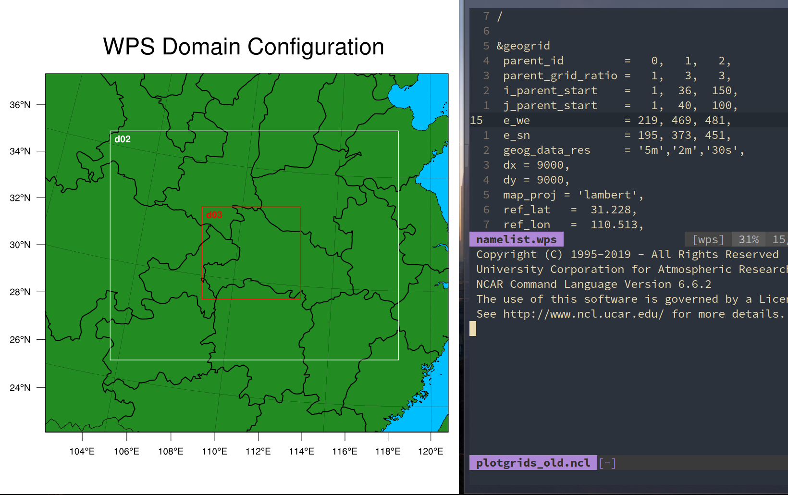

# WPS_DOMAIN
A simple way to help you adjust your WPS DOMAIN .

## Need
Make sure your linux system can use X11，you also need ncl to draw picture and vim to set some shortcutkey misc .
* ncl
* vim
* xorg

## Vim setting
You need to add these into your `.vimrc`  or  `.config/nvim/init.vim`
``` 
" Compile function
noremap r :call CompileRunGcc()<CR>
func! CompileRunGcc()
	exec "w"
	if &filetype == 'ncl'
		set splitbelow
		:sp
		:term ncl %
	elseif &filetype == 'wps'
		set splitbelow
		:sp
		:term ncl ./plotgrids_old.ncl
	endif
endfunc
```

## How to use

Open namelist.wps with namelist.wps with vim or nvim and press r in command mode, you can see the domain your set .

<center></center>
